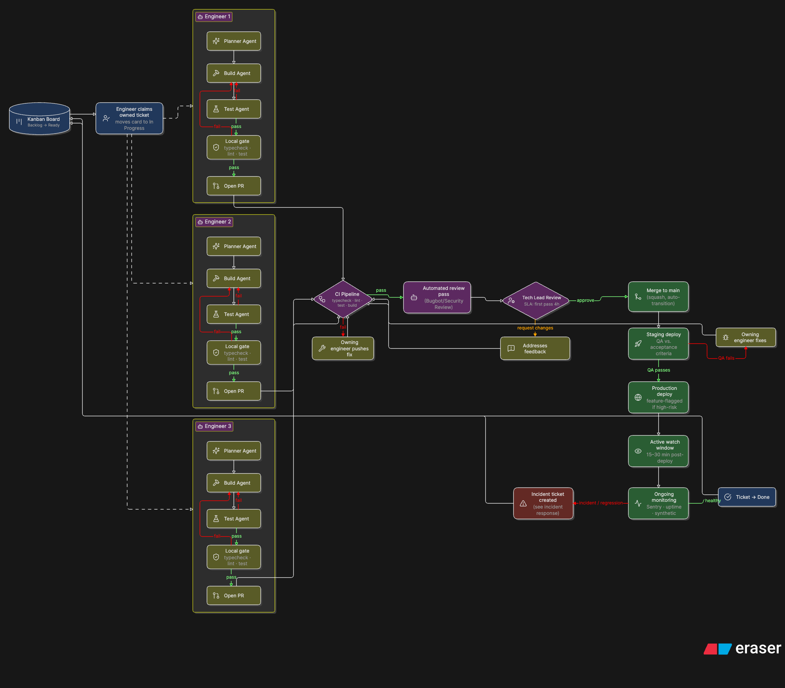

# ai-workflow

Monorepo starter: **Express API** + **React SPA**, with an AI-native development workflow
built entirely on Cursor's native customization — no `CLAUDE.md`/`AGENTS.md` layer, just
[Rules](https://cursor.com/docs/rules.md) (`.cursor/rules/`) and
[Agent Skills](https://cursor.com/docs/skills.md) (`.cursor/skills/`).
Conventions live there, not in a separate doc, so they're always in context and scoped
to the files they apply to.



More detail: [docs/agentic-engineering-workflow.md](docs/agentic-engineering-workflow.md) and [docs/team-workflow-kanban-to-production.md](docs/team-workflow-kanban-to-production.md).

## Stack

| App      | Location        | Tech                                                         |
| -------- | --------------- | ------------------------------------------------------------ |
| Backend  | `apps/backend`  | Express 4, TypeScript, PostgreSQL, Drizzle, Zod, JWT, Vitest |
| Frontend | `apps/frontend` | React 19, Vite, TanStack Query, React Router, Zod, Vitest    |

## Getting started

```bash
cp apps/backend/.env.example apps/backend/.env   # set DATABASE_URL, JWT_SECRET, etc.
docker compose up -d
npm install
npm run db:migrate
npm run db:seed                                  # optional: dev@example.com / password123

npm run dev:backend                              # :3000
npm run dev:frontend                             # :5173
```

Verify:

```bash
curl http://localhost:3000/health
open http://localhost:5173
```

## Everyday commands (repo root)

| Command                | What it does                              |
| ---------------------- | ----------------------------------------- |
| `npm run dev:backend`  | API with hot reload                       |
| `npm run dev:frontend` | SPA with Vite (proxies `/api` to backend) |
| `npm run typecheck`    | TypeScript — all workspaces               |
| `npm run lint`         | ESLint — all workspaces                   |
| `npm run test`         | Backend integration tests (real Postgres) |
| `npm run build`        | Production builds                         |

## Repository layout

```
apps/
  backend/     Express API, Drizzle migrations, integration tests
  frontend/    React SPA
.cursor/
  rules/       Always-on and file-scoped agent rules (.mdc)
  skills/      Tech-stack skills, /new-resource, the /spec../ship lifecycle entry points,
               and all 24 lifecycle skills from addyosmani/agent-skills (see below)
  references/  7 checklists (security, testing, performance, a11y, observability, DoD,
               orchestration) that lifecycle skills pull in on demand
  agents/      4 specialist review personas (code-reviewer, test-engineer,
               security-auditor, web-performance-auditor)
agent-skills/  Git submodule, pinned to a commit — upstream vendor copy, source for
               syncing .cursor/{skills,references,agents}/. Not read by Cursor directly.
docs/          Engineering workflow documentation
  images/      Architecture & AI-workflow diagrams (manual; see docs/images/README.md)
skills-lock.json  Record of what was last synced from agent-skills/ into .cursor/
```

Cursor auto-discovers project skills from either `.cursor/skills/` or `.agents/skills/`
(both are equivalent — see [cursor.com/docs/skills](https://cursor.com/docs/skills)); this repo
keeps everything under `.cursor/` as the single source of truth since it's Cursor-only. `references/`
and `agents/` aren't auto-loaded by Cursor the same way skills are — they're plain files that
skills point to by relative path, read on demand the same way any other file is.

App-specific architecture skills (auto-scoped to each package in monorepos):

- `apps/backend/.cursor/skills/backend-architecture/`
- `apps/frontend/.cursor/skills/frontend-architecture/`

Deeper, tech-specific skills live in the top-level `.cursor/skills/` (visible under
Cursor's Customize → Skills) and auto-surface for matching files via each skill's `paths`
frontmatter: `express-api-layering`, `drizzle-postgres-patterns`, `jwt-auth-flow`,
`vitest-integration-testing`, `react-query-data-layer`, `react-feature-structure`,
`vite-react-tooling`.

Invoke any of these in Cursor Agent with `/<skill-name>`, e.g. `/backend-architecture` or
`/drizzle-postgres-patterns`.

## Testing

Backend tests in `apps/backend/tests/` run against real Postgres locally and in CI.
Frontend unit tests live beside features under `apps/frontend/src/`.

## Agent workflow

- **Rules** in `.cursor/rules/` — short, always-on or file-scoped constraints:
  `monorepo.mdc`, `backend.mdc`, `frontend.mdc`, `workflow.mdc` (definition of done),
  `git-conventions.mdc`.
- **Skills** — detailed, multi-step workflows: architecture overviews per app
  (`apps/<app>/.cursor/skills/`), deep tech-specific patterns and the `/new-resource`
  scaffold in the top-level `.cursor/skills/`, and the full engineering lifecycle
  (below), also in `.cursor/skills/`.

When adding a backend resource, read `apps/backend/src/modules/users/` and run
`/new-resource` in Cursor Agent (see `.cursor/skills/new-resource/SKILL.md`).

### End-to-end lifecycle (`addyosmani/agent-skills`)

`.cursor/skills/` carries all 24 lifecycle skills from
[addyosmani/agent-skills](https://github.com/addyosmani/agent-skills), tracked in
`skills-lock.json`, covering the full **Define → Plan → Build → Verify → Review → Ship**
pipeline:

| Phase  | Skill(s)                                                                                                                                                                                       |
| ------ | ---------------------------------------------------------------------------------------------------------------------------------------------------------------------------------------------- |
| Meta   | `using-agent-skills` — routes any task to the right skill                                                                                                                                      |
| Define | `interview-me`, `idea-refine`, `spec-driven-development`                                                                                                                                       |
| Plan   | `planning-and-task-breakdown`                                                                                                                                                                  |
| Build  | `incremental-implementation`, `test-driven-development`, `context-engineering`, `source-driven-development`, `doubt-driven-development`, `frontend-ui-engineering`, `api-and-interface-design` |
| Verify | `debugging-and-error-recovery`, `browser-testing-with-devtools`                                                                                                                                |
| Review | `code-review-and-quality`, `security-and-hardening`, `code-simplification`, `performance-optimization`                                                                                         |
| Ship   | `git-workflow-and-versioning`, `ci-cd-and-automation`, `deprecation-and-migration`, `documentation-and-adrs`, `observability-and-instrumentation`, `shipping-and-launch`                       |

Their 7 supporting checklists live in `.cursor/references/` and the 4 specialist review
personas live in `.cursor/agents/` (`code-reviewer`, `test-engineer`, `security-auditor`,
`web-performance-auditor`) — synced 1:1 from upstream `references/` and `agents/` so a
skill's relative mention of `references/x.md` / `agents/x.md` resolves correctly.

The upstream repo's `/spec /plan /build /test /review /code-simplify /webperf /ship`
shortcuts live in Claude/Gemini-specific command folders that Cursor doesn't read, so
this repo adds matching entry-point skills in
`.cursor/skills/{spec,plan,build,test,review,code-simplify,webperf,ship}/` — each is a
short pointer into the relevant lifecycle skill plus this repo's own architecture
skills/rules, invoked the same way: type `/spec`, `/plan`, `/build`, `/test`, `/review`,
`/code-simplify`, `/webperf`, or `/ship` in Cursor Agent. A typical feature runs `/spec
/plan /build /test /review /ship` in order; a small bug fix might only need `/test`
(which routes to `debugging-and-error-recovery` on failure) then `/review`.

**Updating from upstream:** per
[agent-skills' own Cursor setup guide](https://github.com/addyosmani/agent-skills/blob/main/docs/cursor-setup.md),
`.cursor/skills/` is the source of truth for the agent — `agent-skills/` is a pinned git
submodule (upstream vendor copy, "Upstream source only") that you sync from, not a
location Cursor reads directly:

```bash
git submodule update --remote agent-skills   # bump the pinned commit to latest upstream
git diff --stat agent-skills                 # review what changed before syncing
rsync -a agent-skills/skills/ .cursor/skills/         # skill bodies
rsync -a agent-skills/references/ .cursor/references/ # checklists
rsync -a agent-skills/agents/ .cursor/agents/         # personas
git add agent-skills .cursor/skills .cursor/references .cursor/agents
```

After a fresh `git clone` of this repo, run `git submodule update --init` to pull the
submodule down (or clone with `--recurse-submodules`).

`npx skills add addyosmani/agent-skills --list` is still useful for browsing what's
available, but `npx skills add`/`update` write to `.agents/skills/` (a separate
Cursor-compatible convention this repo doesn't use) rather than `.cursor/skills/`, so
don't rely on them to keep this tree in sync — use the submodule + `rsync` steps above
and update the hashes in `skills-lock.json` by hand after reviewing the diff.
