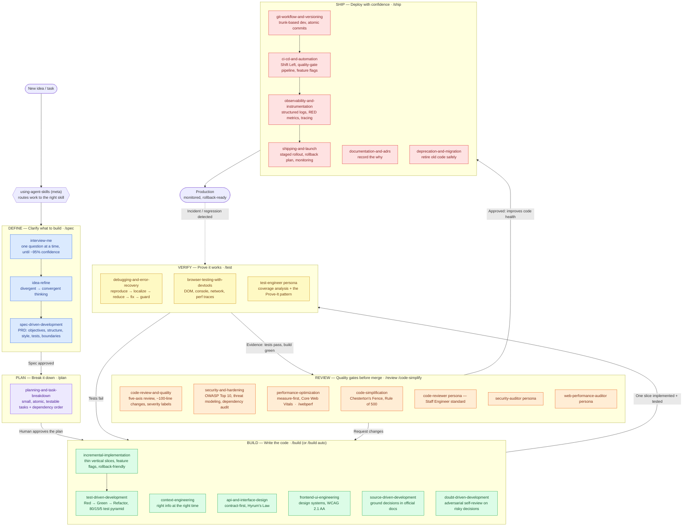
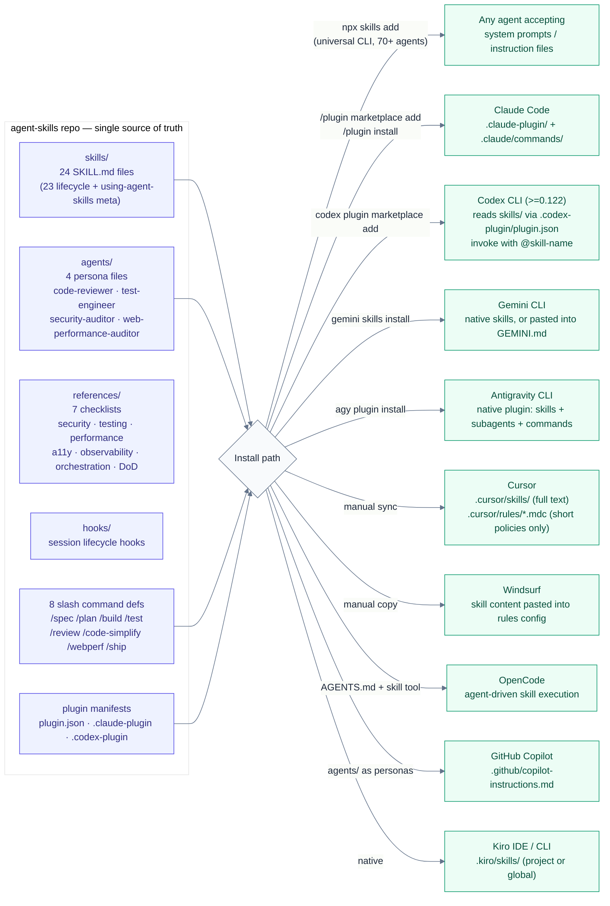
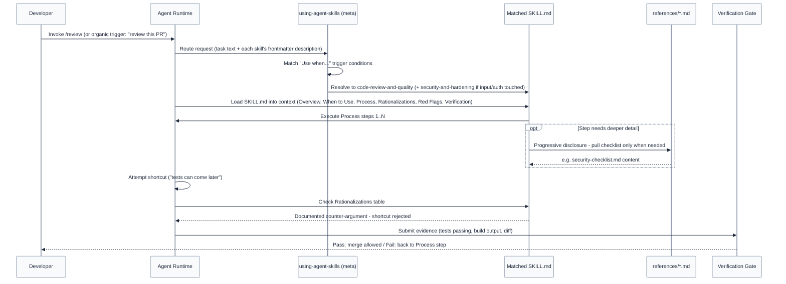

# Production-Grade Agentic Engineering Workflow

**Sources:**

- [addyosmani/agent-skills](https://github.com/addyosmani/agent-skills) — "Production-grade engineering skills for AI coding agents," 24 skills mapped to a `DEFINE → PLAN → BUILD → VERIFY → REVIEW → SHIP` lifecycle, 8 slash commands, 4 specialist agent personas.
- [FORGET Loop Engineering. Agentic Engineering is about THIS](https://www.youtube.com/watch?v=VQy50fuxI34) — argues effective agentic engineering isn't an unstructured prompt-and-retry loop, but a gated pipeline with verification at every step (the thesis this diagram operationalizes).

## Diagram

## Reading the diagram

- **Meta routing (`using-agent-skills`)** — the entry point for every session: decides which skill(s) apply before any work starts, so an agent doesn't skip straight to code.
- **Six phases, 8 commands, 24 skills** — each phase maps to one or two slash commands (`/spec`, `/plan`, `/build`, `/test`, `/review`, `/code-simplify`, `/webperf`, `/ship`) and activates the relevant skills automatically (e.g. designing an API triggers `api-and-interface-design`).
- **Two feedback loops, not a straight line** — `VERIFY` failures loop back to `BUILD` (fix and re-slice), and `REVIEW` "request changes" loops back to `BUILD` too. This is the core difference from unstructured "loop engineering": failures re-enter a _gated_ step, not an open-ended retry.
- **Agent personas plug into VERIFY/REVIEW** — `test-engineer`, `code-reviewer`, `security-auditor`, and `web-performance-auditor` are specialist lenses applied at the quality-gate phases, not separate pipeline stages.
- **`/build auto`** — collapses `PLAN` + `BUILD` into one approved autonomous pass (you approve the plan once, then every task is still individually test-driven and committed, pausing on failures/risky steps) — it removes the human stepping _between_ tasks, not the verification gates themselves.
- **Post-ship loop** — production incidents/regressions re-enter at `VERIFY`, not at `DEFINE` — the fix goes through the same test → review → ship gates as any other change.

## Why this matches "Agentic Engineering is about THIS," not loop engineering

The video's core argument (per its title/thesis) is that agentic coding value doesn't come from bigger prompt loops or longer autonomous runs — it comes from **enforced structure**: specs before code, small verifiable slices, mandatory review axes, and evidence-based verification at every gate. That's exactly what this pipeline encodes: no phase transition happens without an artifact (spec, plan, passing tests, review approval) — the loop only ever re-enters a gated phase, never bypasses one.

---

## Technical Architecture

The diagram above is the _process_ view (what phase you're in). This section is the _implementation_
view — how the `agent-skills` package is actually structured as a repo, how it gets distributed into
different agent runtimes, and what happens mechanically when a skill fires.

### Package & distribution architecture

The repo is one source of truth (`skills/`, `agents/`, `references/`, `hooks/`, command defs, plugin
manifests). Every supported tool consumes the same source through a different adapter mechanism —
some are native plugin installs, some are file copies, some are just Markdown pasted into a
tool-specific instruction file.

**Note for this repo specifically:** we followed the Cursor adapter pattern above end-to-end, per
upstream's own
[`docs/cursor-setup.md`](https://github.com/addyosmani/agent-skills/blob/main/docs/cursor-setup.md) —
`.cursor/skills/` is "the source of truth for the agent." All 24 skills live there with full
text, their 7 supporting checklists live in `.cursor/references/`, and the 4 specialist
personas live in `.cursor/agents/` — all synced 1:1 from upstream so in-skill relative
mentions of `references/x.md` / `agents/x.md` resolve correctly. Cursor also auto-discovers
project skills from `.agents/skills/` (they're equivalent per
[cursor.com/docs/skills](https://cursor.com/docs/skills)), but this repo standardized on
`.cursor/skills/` alone since it's Cursor-only today (no `.claude/`, `.codex/`, `.zed/`, etc.).
One consequence: the `npx skills` CLI's `add`/`update` commands hardcode `.agents/skills/` as
their Cursor write target, so they can't manage this tree — upstream updates are synced by
bumping the pinned `agent-skills/` git submodule (the doc's "Optional: git submodule or vendor
clone" layout element) and `rsync`-ing its `skills/`, `references/`, and `agents/` into their
`.cursor/` counterparts (see README). `skills-lock.json` is kept as a record of what was last
synced. A routing rule,
`.cursor/rules/agent-skills.mdc`, points the agent at `using-agent-skills` before non-trivial
work, matching the doc's "Add minimal project rules" step. All 8 lifecycle commands (`/spec
/plan /build /test /review /code-simplify /webperf /ship`) are implemented as
`disable-model-invocation` skills under `.cursor/skills/<command>/`, since Cursor has no native
slash-command or subagent-spawning primitive — commands read the matching persona file directly
instead of delegating to a subagent tool. Short, enforceable policies are pulled into
`.cursor/rules/*.mdc` rather than pasting entire skill files into always-on context.

### Skill resolution & execution flow (what happens when a skill fires)

This is the mechanical sequence behind a single skill invocation — how `using-agent-skills` routes
work, how progressive disclosure keeps token usage low, and how the anti-rationalization table and
verification gate stop an agent from silently skipping a step.

### Reading the technical diagrams

- **One source, many adapters.** The 24 `SKILL.md` files never change per tool — only how they're
  _surfaced_ changes: full-text install (Claude Code `.claude/skills/`, Cursor `.cursor/skills/`
  or `.agents/skills/`), plugin manifest read (Codex), pasted-into-instructions (Copilot,
  Windsurf, Gemini's `GEMINI.md` path), or
  agent-driven lookup (OpenCode's `skill` tool). This is why the same skill pack works across 70+
  agents without a rewrite per tool.
- **Frontmatter is the router, not the content.** `using-agent-skills` only reads each skill's
  `description` field (its "Use when…" trigger) to decide relevance — the full body only loads once
  a skill is actually selected. This keeps meta-routing cheap even with 24 skills installed.
  Frontmatter is intentionally short; instruction bodies are looked up lazily.
- **Progressive disclosure = the `references/` split.** Checklists (security, testing, performance,
  a11y, observability) are separate files specifically so they don't bloat every skill's context —
  they're pulled in only at the `Process` step that actually needs them.
- **The anti-rationalization table is the enforcement mechanism**, not documentation. It's a
  pre-written table of excuses ("I'll add tests later," "this is a small change, skip review") each
  paired with a counter-argument, so a shortcut has to be argued past explicitly rather than silently
  taken.
- **Verification is evidence, not self-report.** The gate at the end of every skill requires an
  artifact — passing test output, a build log, a diff — before a step counts as done. "Looks right"
  never satisfies it.
