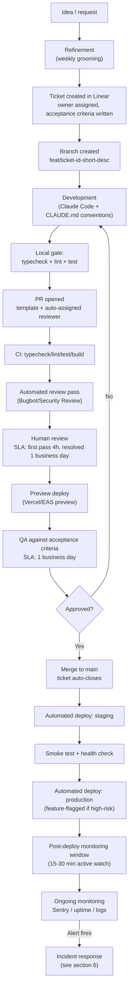

# Engineering Process & Tooling Proposal

**Status:** Draft for discussion
**Audience:** Founder + engineering team (1 tech lead, 3 developers)
**Context assumed:** Next.js / React Native full-stack product, PostgreSQL, Xero
(accounting) and Clerk (auth) integrations, team already uses Claude Code daily.
Adjust names/tools freely — the structure and rationale matter more than the specific
vendor picked for each slot.

---

## 0. Goals this proposal is designed to hit

- The founder doesn't need to get pulled in when something breaks.
- Every ticket has one named owner, end to end — nothing stalls with no owner.
- Every PR gets reviewed against a clear SLA.
- Deployments are predictable, documented, and reversible.
- Incidents are caught by monitoring before a customer reports them, and the team
  resolves them without escalation in the common case.
- Decisions are written down, not trapped in Slack or in someone's Claude Code session.

---

## 1. Tooling stack

| Category                  | Tool                                                                                                        | Why                                                                                                                                                                     |
| ------------------------- | ----------------------------------------------------------------------------------------------------------- | ----------------------------------------------------------------------------------------------------------------------------------------------------------------------- |
| Communication             | **Slack**                                                                                                   | Standard, integrates with everything below. Structured channels (see §1.1), not a source of truth for decisions.                                                        |
| Ticketing / project mgmt  | **Linear**                                                                                                  | Fast, keyboard-driven, best-in-class GitHub integration (branch names, PR status, auto state transitions). Jira is a fine substitute if already standardized elsewhere. |
| Documentation / decisions | **Notion** (or Confluence)                                                                                  | ADRs, runbooks, onboarding docs, incident postmortems. One doc per decision of consequence — see §7.                                                                    |
| Source control            | **GitHub**                                                                                                  | Branch protection, required reviews, required status checks, CODEOWNERS.                                                                                                |
| CI/CD                     | **GitHub Actions**                                                                                          | Typecheck/lint/test/build gates; triggers deploys.                                                                                                                      |
| Web deploy                | **Vercel** (Next.js)                                                                                        | Atomic deploys, instant rollback, automatic per-PR preview environments — this alone solves a large chunk of "deployment fragility."                                    |
| Mobile deploy             | **EAS (Expo Application Services)**                                                                         | Build + phased/staged rollout for React Native, OTA updates for non-native-code changes without an app store review cycle.                                              |
| Database hosting          | **Neon or RDS** (Postgres)                                                                                  | Branching (Neon) is genuinely useful for per-PR ephemeral DBs in preview environments.                                                                                  |
| Migrations                | **Drizzle Kit** (or Prisma Migrate)                                                                         | Migrations are generated, committed, and reviewed as code — never run ad hoc against prod.                                                                              |
| Error tracking            | **Sentry**                                                                                                  | Frontend (Next.js + React Native SDKs) and backend, one pane of glass for a stack trace regardless of where it happened.                                                |
| Uptime / synthetic checks | **Checkly or Better Stack**                                                                                 | Hits `/health` and 2-3 critical user flows (e.g. "can a booking be created", "can a payment be recorded") every 1-5 min from outside your infra.                        |
| Logs                      | **Better Stack / Axiom** (or Vercel + Datadog if budget allows)                                             | Structured JSON logs (Pino), searchable, 30-day retention minimum.                                                                                                      |
| Incident/on-call          | **Slack + a simple rotation** to start; **PagerDuty/Opsgenie** once on-call actually needs phone escalation | Don't over-buy tooling before you've proven you need it — see §9.                                                                                                       |
| Secrets                   | **Vercel env vars + 1Password** (or Doppler)                                                                | Never in `.env` committed to git, never pasted in Slack.                                                                                                                |
| Design handoff            | **Figma**, linked from the ticket                                                                           | Every UI ticket links a frame, not a screenshot in a DM.                                                                                                                |
| AI-native dev             | **Claude Code** + a committed `CLAUDE.md` + `.claude/commands/`                                             | Already in place — this is the standardization layer so every dev and every agent session builds the same way.                                                          |
| Dependency hygiene        | **Renovate or Dependabot**                                                                                  | Auto-PRs for dependency bumps; auto-merge patch versions once CI is green.                                                                                              |
| Automated PR review       | **Bugbot / Security Review** (or equivalent) as a first pass                                                | Runs before a human looks at it — catches the obvious stuff so human review time is spent on logic/architecture, not typos.                                             |

### 1.1 Slack channel structure

- `#eng-general` — day-to-day discussion
- `#eng-prs` — bot-posted PR opened/approved/merged notifications
- `#deploys` — bot-posted deploy start/success/failure per environment
- `#alerts` — Sentry + uptime + synthetic check alerts land here, nowhere else
- `#eng-incidents` — only opened when there's an active incident; closed out with a link to the postmortem doc

Rule: **if a decision is made in Slack, it gets written down within the same day** — a
one-paragraph doc, or a comment on the relevant ticket/ADR. Slack is for coordination,
not memory.

---

## 2. Development flow: idea → production

### Stage-by-stage detail

1. **Idea intake.** Anyone can drop an idea in a Linear "Triage" state or a Slack thread
   forwarded into Linear. It does not become a ticket until it has a stated problem and
   a rough sense of why it matters.
2. **Refinement.** Weekly (or twice-weekly for a fast-moving team), the tech lead grooms
   the backlog: scope, acceptance criteria, rough estimate, priority. A ticket doesn't
   leave "Backlog" for "Ready" without these three things.
3. **Ticket creation.** Every ticket gets a **named owner** the moment it enters "Ready"
   — not when someone happens to pick it up. Ownership means "responsible for this
   reaching production," not just "wrote the code."
4. **Branching.** `<type>/<ticket-id>-<short-desc>`, e.g. `feat/ENG-142-vendor-invoice-export`.
   Linear's GitHub integration auto-links the branch/PR to the ticket and moves ticket
   state as the PR moves.
5. **Development.** Claude Code sessions start from the ticket's acceptance criteria and
   the repo's `CLAUDE.md`. For anything non-trivial, the agent proposes a plan before
   writing code, and the developer reviews the plan, not just the eventual diff.
6. **Local gate.** `npm run typecheck && npm run lint && npm run test` before pushing.
   Enforced by a pre-commit hook (lint-staged) and pre-push hook for the full suite.
7. **PR opened.** Template requires: what changed, why, how it was tested, screenshots
   for UI changes, and an explicit rollback plan for anything touching deploy/migration/
   payment logic. CODEOWNERS auto-assigns a reviewer.
8. **CI.** Must pass before a human review is requested: typecheck, lint (zero warnings),
   unit + integration tests, build.
9. **Automated review pass.** A bot-based review (Bugbot/Security Review or similar)
   comments first, catching obvious issues — this is specifically valuable for
   AI-generated code, which tends to look clean but can hide subtly wrong edge-case
   handling.
10. **Human review.** SLA: first response within **4 business hours**, fully resolved
    (approved or sent back) within **1 business day**. PR size norms (see §5) exist
    specifically so this SLA is achievable.
11. **Preview deploy + QA.** Every PR gets an isolated preview URL (Vercel) / build
    (EAS). QA is done against the ticket's written acceptance criteria, not "does it
    look right" — SLA: **1 business day** from PR approval.
12. **Merge.** Squash merge to `main`. Ticket auto-transitions to Done.
13. **Deploy.** Automatic to staging on merge; automatic to production after a smoke
    test passes on staging (or manual one-click promote, if you want a human gate on
    prod initially — recommend automating this away within the first 60 days once trust
    is established).
14. **Post-deploy verification.** Automated smoke test hits critical endpoints; a human
    actively watches error rate/logs for 15-30 minutes after any production deploy,
    especially ones touching payments/invoicing.
15. **Monitoring.** Ongoing — see §4.

---

## 3. Branching & release strategy

- **Trunk-based development.** Short-lived feature branches (target: under 2 days
  old before merge). Long-lived branches are exactly how deploys become fragile —
  they accumulate drift and turn merge day into a gamble.
- **Feature flags** (simple DB-backed flag table or a service like LaunchDarkly/Vercel
  Edge Config) decouple _deploying_ code from _releasing_ a feature. This is the
  single highest-leverage change for de-risking anything touching Xero sync or
  payment flows: ship the code dark, flip it on for one internal user, then everyone.
- **Environments:** local → per-PR preview → staging → production. No one deploys
  straight to production from a laptop, ever — if that's happening today, it is the
  single most likely source of the "known deployment fragility" mentioned in scope.
- **Migrations:** forward-only, expand/contract pattern (add new column → backfill →
  switch reads → drop old column in a later release) so a deploy is never blocked
  on a migration running to completion, and a rollback of the _code_ never requires
  rolling back the _schema_.

---

## 4. Monitoring & alerting

| Signal                             | Tool                                                      | Alert threshold                                        | Goes to                                             |
| ---------------------------------- | --------------------------------------------------------- | ------------------------------------------------------ | --------------------------------------------------- |
| Unhandled errors (BE/FE/mobile)    | Sentry                                                    | Any new error type; error rate spike >X% over baseline | `#alerts`, PagerDuty for P1                         |
| Uptime                             | Checkly/Better Stack                                      | 2 consecutive failed health checks (~2-5 min)          | `#alerts` → on-call                                 |
| Synthetic critical flows           | Checkly (scripted: create booking, record payment)        | Any failure                                            | `#alerts` → on-call immediately (business-critical) |
| Xero sync failures                 | Custom check on sync job (log + alert on non-2xx/timeout) | Any failure                                            | `#alerts`, tagged high-priority — money-adjacent    |
| DB health                          | Provider dashboard (Neon/RDS) + custom `/health` check    | Connection pool >80%, replication lag, disk >80%       | `#alerts`                                           |
| Latency / error rate (RED metrics) | Vercel Analytics + Sentry Performance                     | p95 latency regression, error rate >1%                 | Weekly review, alert on sharp spike                 |
| Deploy status                      | GitHub Actions + Vercel/EAS webhooks                      | Any failed deploy                                      | `#deploys`                                          |

**Runbooks:** every alert type links to a Notion runbook with "what this means, what to
check first, who to escalate to if you can't resolve it in 30 minutes." This is what
actually lets the team handle incidents without pulling in the founder — the knowledge
has to live somewhere other than one person's head.

---

## 5. Automation checklist

- [ ] CI pipeline: typecheck → lint → unit tests → integration tests → build → preview deploy, all required status checks on `main`
- [ ] Pre-commit hook (lint-staged): auto-fix lint/format on staged files
- [ ] Pre-push hook (optional): full test suite
- [ ] Renovate/Dependabot: weekly dependency PRs, auto-merge patch bumps after green CI
- [ ] Automated bot PR review pass before requesting human review
- [ ] PR size guardrail: warn/block PRs over ~400 lines without an explicit justification comment
- [ ] Auto-labeling by files touched (e.g. `db-migration`, `payments`, `mobile`) to route review and flag high-risk PRs for extra scrutiny
- [ ] Scheduled DB backup + **restore drill** verification (a backup nobody has restored is not a tested backup)
- [ ] Synthetic monitoring on critical business flows, not just uptime
- [ ] Claude Code `.claude/commands/` for repeatable scaffolds (already started: `/new-resource`) — add `/pr-description`, `/triage-bug` as next candidates
- [ ] Stale PR/ticket reminder bot (anything untouched >3 days pings the owner in `#eng-general`)

---

## 6. Incident response (lightweight, for a team of 4)

1. **Detect** — alert fires in `#alerts`, or someone notices manually.
2. **Declare** — whoever notices posts in `#eng-incidents` with a one-line summary and
   claims it (or pages on-call). No one waits for permission to declare an incident.
3. **Mitigate** — fastest safe path to stop customer impact (rollback, flag-off, hotfix).
   Rollback via Vercel/EAS is a button, not a deploy — this is why atomic deploys matter.
4. **Communicate** — status update every 30 min in the incident channel until resolved,
   even if the update is "still investigating."
5. **Resolve** — confirm via monitoring that the signal is back to baseline.
6. **Postmortem** — for any P1/P2, written within 48 hours: timeline, root cause,
   what alerted (or should have), action items with owners. Blameless — the point is
   the system that let it happen, not the person who triggered it.

**On-call:** start with a simple weekly rotation among the 4 engineers, business hours
only, escalating to the tech lead if unresolved after 30 minutes, and to the founder
only if unresolved after a defined SLA (e.g. 2 hours for P1). Formal paging tooling
(PagerDuty) is worth adding once there's an actual after-hours incident that a
Slack-only process failed to catch — don't buy it preemptively.

---

## 7. Decisions of consequence — written down, always

Anything in this list gets a short doc (Notion ADR or PR description at minimum)
before or immediately after it happens:

- Schema changes
- New external dependency
- Any approach with a real tradeoff (e.g. "we chose eventual consistency for X because...")
- Anything touching deploy or migration behavior
- Incident postmortems

Template: **Context → Options considered → Decision → Why → Owner.** Keep it to one
page. The goal isn't ceremony, it's that six months from now nobody has to ask "why did
we do it this way" in a Slack thread that's since scrolled off.

---

## 8. SLAs summary

| Activity                                  | SLA                                               |
| ----------------------------------------- | ------------------------------------------------- |
| First response on a PR                    | 4 business hours                                  |
| PR fully resolved (approved or sent back) | 1 business day                                    |
| QA handoff after PR approval              | 1 business day                                    |
| P1 incident acknowledged                  | 15 minutes                                        |
| P1 incident mitigated                     | 2 hours                                           |
| P2 incident acknowledged                  | 4 hours                                           |
| P2 incident mitigated                     | 1 business day                                    |
| Postmortem published (P1/P2)              | 48 hours after resolution                         |
| Dependency security patch merged          | 3 business days of CVE disclosure (high/critical) |

---

## 9. Metrics to track (DORA-style)

Track monthly, review in a short retro:

- **Deployment frequency** — target: daily or better once trunk-based flow is stable
- **Lead time for changes** — ticket "Ready" → production
- **Change failure rate** — % of deploys causing a rollback/hotfix
- **MTTR** — mean time to restore service after an incident

These four numbers, tracked over time, are the actual evidence that "deployments are
predictable" and "the team handles incidents on their own" — the two things the founder
cares about most — are trending the right direction, without anyone having to take it
on faith.

---

## 10. Rollout plan

**Weeks 1-2 — Audit & foundation**

- Codebase + process audit (what's actually happening vs. what's on paper)
- Stand up Linear, Slack channel structure, CODEOWNERS, PR template
- Commit `CLAUDE.md` + baseline `.claude/commands/`
- Identify and document the specific deployment fragility (root cause, not just symptom)

**Weeks 3-6 — Harden the pipeline**

- CI gates enforced on `main` (typecheck/lint/test/build required)
- Preview environments live for every PR
- Sentry + uptime/synthetic monitoring stood up, alert routing to `#alerts`
- Review SLAs enforced and visible (dashboard or bot-posted aging PRs)
- Fix the known deployment fragility; document the fix + runbook

**Weeks 7-12 — Prove it**

- Feature flags in place for at least one high-risk flow (payments/Xero)
- Run one deliberate incident response drill
- DORA metrics dashboard live, first monthly review
- On-call rotation running for at least one full cycle without founder involvement

---

## 11. Rough monthly tooling cost (team of 4-5)

| Tool                 | Est. monthly cost                                |
| -------------------- | ------------------------------------------------ |
| Linear               | ~$8-14/user                                      |
| Vercel (Pro)         | ~$20/user                                        |
| Sentry (Team plan)   | ~$26+ (usage-based)                              |
| Checkly/Better Stack | ~$20-80                                          |
| Notion               | ~$8-10/user                                      |
| GitHub (Team)        | ~$4/user                                         |
| Neon (Postgres, Pro) | ~$20-70 usage-based                              |
| **Total**            | **roughly $400-800/month** for a 4-5 person team |

Adjust down by consolidating (e.g. Better Stack covers logs + uptime + incident
comms in one plan) if budget is tight early on — the monitoring/alerting layer is the
one area worth not cutting, since it's directly what lets the team catch problems
before the founder or a customer does.
