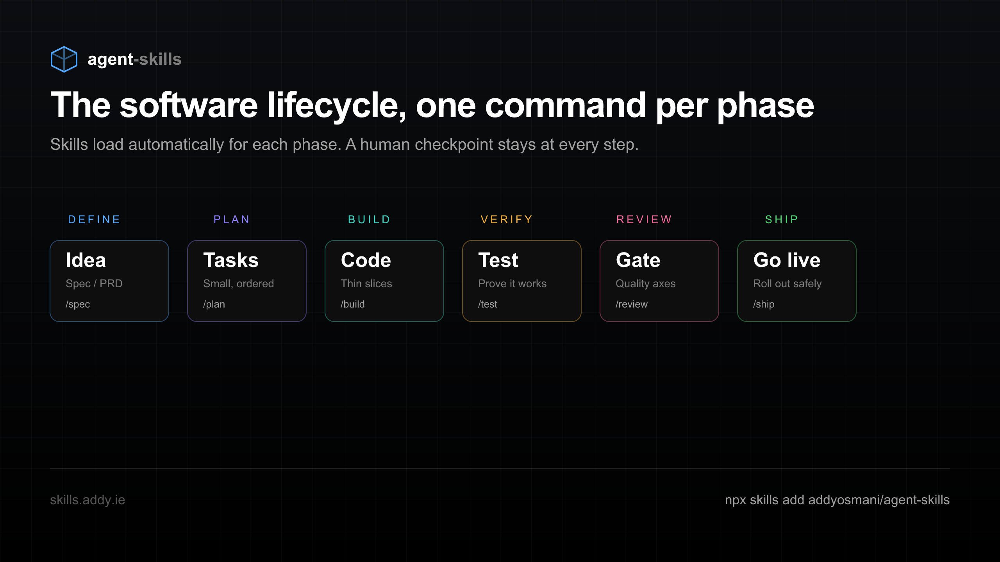

# Documentation images

Architecture, AI-workflow, and process diagrams for markdown under `docs/`.

**Not for SPA / marketing assets** — those live under `apps/frontend/public/` (e.g. `public/poto/`).

## Add an image

1. Drop the file here: `docs/images/<descriptive-kebab-name>.png` (or `.svg`).
2. Prefer PNG or SVG for diagrams; keep files reasonably small for git.
3. Embed from the markdown that references it with a **relative** path.

From a file in `docs/`:

```markdown

```

From a nested file (e.g. `docs/specs/…`):

```markdown

```

## Current assets

| File              | Topic                                                    |
| ----------------- | -------------------------------------------------------- |
| `ai-workflow.png` | Agentic engineering / AI workflow overview               |
| `lifecycle.png`   | DEFINE → PLAN → BUILD → VERIFY → REVIEW → SHIP lifecycle |
