# Team Workflow: Kanban Board → Production

**Team:** 1 tech lead + 3 engineers
**Scope:** High-level process view — how a ticket moves from the board to a monitored production
deploy. For the per-engineer agent execution detail (Planner → Build → Test → Review loop inside
one worktree), see the reference diagram this was scoped down from; that's the "zoom in" on any
single `Engineer N` lane below.

This pairs with [`engineering-process-proposal.md`](./engineering-process-proposal.md) (SLAs, tooling,
monitoring detail) and [`agentic-engineering-workflow.md`](./agentic-engineering-workflow.md) (the
skill-level DEFINE→PLAN→BUILD→VERIFY→REVIEW→SHIP breakdown) — this diagram is the org/process layer
that sits between those two.

## Diagram

Recolored to match a dark cloud-architecture style — four color families instead of five pastel
ones: **Kanban** (navy/blue), **Engineering agents** (gold), **Validation/review** (purple),
**Ship & Monitor** (green), and dashed gold **fix-loop** nodes for anything that gets sent back to
an engineer. Structure is unchanged from the original — only theme, palette, and node styling
were adjusted, so the layout stays exactly as validated before.

```mermaid
%%{init: {'theme': 'base', 'themeVariables': {'background': '#0b0e14', 'primaryColor': '#111827', 'primaryTextColor': '#e5e7eb', 'primaryBorderColor': '#374151', 'lineColor': '#94a3b8', 'fontFamily': 'Inter, Segoe UI, sans-serif'}}}%%
flowchart LR
    KB[("Kanban Board\nBacklog → Ready\nowner assigned before Ready")]

    KB --> Claim["Engineer claims owned ticket\nmoves card to In Progress"]

    Claim --> E1
    Claim --> E2
    Claim --> E3

    subgraph E1["Engineer 1 — own branch/worktree"]
        direction TB
        E1P["Planner Agent\n(Claude Code, from ticket + CLAUDE.md)"] --> E1B["Build Agent"]
        E1B --> E1T["Test Agent"]
        E1T -- fail --> E1B
        E1T -- pass --> E1L["Local gate\ntypecheck · lint · test"]
        E1L -- fail --> E1B
        E1L -- pass --> E1PR["Open PR\n(template: what/why/tested/rollback)"]
    end

    subgraph E2["Engineer 2 — own branch/worktree"]
        direction TB
        E2P["Planner Agent"] --> E2B["Build Agent"]
        E2B --> E2T["Test Agent"]
        E2T -- fail --> E2B
        E2T -- pass --> E2L["Local gate\ntypecheck · lint · test"]
        E2L -- fail --> E2B
        E2L -- pass --> E2PR["Open PR"]
    end

    subgraph E3["Engineer 3 — own branch/worktree"]
        direction TB
        E3P["Planner Agent"] --> E3B["Build Agent"]
        E3B --> E3T["Test Agent"]
        E3T -- fail --> E3B
        E3T -- pass --> E3L["Local gate\ntypecheck · lint · test"]
        E3L -- fail --> E3B
        E3L -- pass --> E3PR["Open PR"]
    end

    E1PR --> CI
    E2PR --> CI
    E3PR --> CI

    CI{"CI Pipeline\ntypecheck · lint · test · build"}
    CI -- fail --> Fix1["Owning engineer pushes fix"] --> CI
    CI -- pass --> Bot["Automated review pass\n(Bugbot/Security Review)"]

    Bot --> TL{{"Tech Lead Review (you)\nSLA: first pass 4h · resolved 1 business day"}}
    TL -- "request changes" --> Fix2["Owning engineer addresses feedback"] --> CI
    TL -- approve --> Merge["Merge to main\n(squash, ticket auto-transitions)"]

    Merge --> Staging["Staging deploy (automatic)\n+ QA vs. acceptance criteria — SLA 1 business day"]
    Staging -- "QA fails" --> Fix3["Owning engineer fixes"] --> CI
    Staging -- "QA passes" --> Prod["Production deploy\nfeature-flagged if high-risk (payments/Xero)"]

    Prod --> Watch["Active watch window\n15–30 min post-deploy"]
    Watch --> Monitor["Ongoing monitoring\nSentry · uptime · synthetic checks"]

    Monitor -- "incident / regression" --> Incident["Incident ticket created\n(see incident response process)"]
    Incident --> KB
    Monitor -- "healthy" --> Done[["Ticket → Done"]]
    Done --> KB

    classDef board fill:#0f2942,stroke:#3b82f6,color:#dbeafe;
    classDef eng fill:#3a2f0b,stroke:#eab308,color:#fde68a;
    classDef val fill:#2e1065,stroke:#8b5cf6,color:#ddd6fe;
    classDef ship fill:#052e1c,stroke:#22c55e,color:#bbf7d0;
    classDef fix fill:#3a2f0b,stroke:#eab308,color:#fde68a,stroke-dasharray: 3 3;

    class KB,Claim,Done board;
    class E1P,E1B,E1T,E1L,E1PR,E2P,E2B,E2T,E2L,E2PR,E3P,E3B,E3T,E3L,E3PR eng;
    class CI,Bot,TL val;
    class Fix1,Fix2,Fix3 fix;
    class Merge,Staging,Prod,Watch,Monitor,Incident ship;

    style E1 fill:#241d08,stroke:#eab308,color:#fde68a;
    style E2 fill:#241d08,stroke:#eab308,color:#fde68a;
    style E3 fill:#241d08,stroke:#eab308,color:#fde68a;
```

## How to read it

- **Color = responsibility, not just decoration.** Navy (Kanban) is where work is defined and
  owned; gold (Engineering agents) is where code actually gets produced; purple (Validation) is
  where machine and human review happen; green (Ship & Monitor) is where it becomes real and gets
  watched. The dashed gold "fix" nodes (`Fix1`/`Fix2`/`Fix3`) are deliberately the same gold as
  Engineering — a failure sends work back to the same place it came from, not into a separate
  triage step.
- **One board, three parallel lanes.** All three engineers pull from the same Kanban board, but
  each works in an isolated branch/worktree — no engineer blocks another. This is where the
  detailed per-agent diagram (Planner → Build → Test → local gate) plugs in verbatim, once per
  engineer.
- **You are the single human gate, not a bottleneck by accident.** Automated bot review runs
  _before_ you look at it, so your time goes to logic/architecture, not lint nits. The SLA (4h
  first pass, 1 business day resolved) exists specifically so three engineers' PRs don't queue up
  behind you.
- **Every failure loops back to the same engineer, not into the board.** CI failure, review
  rejection, and QA failure all route back to "owning engineer fixes it," not to a re-triage step
  — the ticket doesn't lose its owner just because round one didn't pass.
- **Staging is mandatory, not optional.** Nothing reaches production without an automatic staging
  deploy + QA pass against the ticket's original acceptance criteria.
- **Production isn't the end of the diagram.** The active watch window + ongoing monitoring is
  what lets the team catch a regression before a customer does — and a caught regression becomes
  a _new ticket back on the same board_, closing the loop instead of being handled ad hoc in Slack.
- **Ticket lifecycle mirrors this diagram directly:** `Backlog → Ready (owned) → In Progress →
In Review → QA → Done`, with `Done` only reached after the monitoring window confirms health,
  not just after merge.

## What this diagram intentionally leaves out

- **Refinement/grooming** (how a card gets from idea to `Ready` with acceptance criteria) — that's
  upstream of this diagram, covered in `engineering-process-proposal.md` §2.
- **Skill-level detail inside each agent step** (which of the 24 skills fire when) — that's the
  `agentic-engineering-workflow.md` diagram, one layer more zoomed-in than this one.
- **Incident response detail** (declare → mitigate → postmortem) — referenced as a single node
  here; full process is in `engineering-process-proposal.md` §6.
